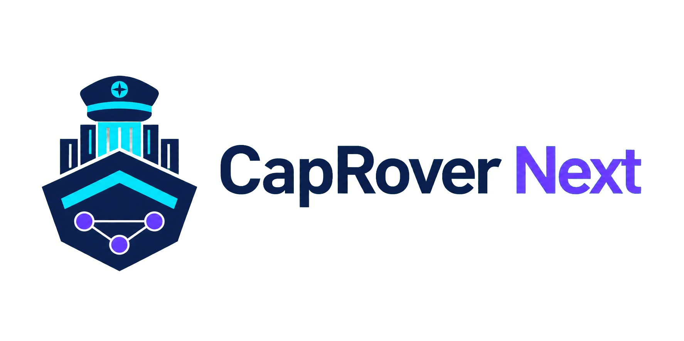
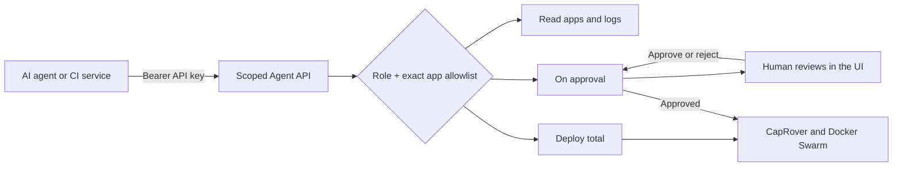

<div align="center">


<h1>CapRover Next</h1>

<p><strong>The deployment control plane built for humans, automation, and AI agents.</strong></p>

<a href="https://hub.docker.com/r/ddornellas/caprover-next/" target="_blank" title="Docker Pulls">

</a>
<a href="https://github.com/ddornellas/caprover_next/releases" target="_blank" title="GitHub release">

</a>
</div>

CapRover Next keeps the simple CapRover workflow—Docker Swarm, nginx,
Let’s Encrypt, and a focused web UI—and adds a secure control channel for
AI-powered deployment agents.

An agent can inspect only the applications it was assigned, submit a build,
wait for a human decision, or deploy automatically according to its role. It
does not need the root password, SSH, or access to the host Docker socket.

> CapRover Next does not run an AI model itself. It provides the constrained,
> auditable deployment API that an external AI agent, CI job, or automation
> service can use safely.

## Why agents are the main step forward

The useful AI deployment loop is not “give an assistant root access and hope
for the best.” It is a controlled handoff:



This makes the agent a deployment participant, not a privileged server user.
The platform remains responsible for authorization, application scope,
deployment state, audit records, and the final Docker operation.

### Three agent roles

| Role | Read apps/logs | Submit deployment | Human approval | Automatic deploy |
| --- | ---: | ---: | ---: | ---: |
| `read` | Yes | No | n/a | No |
| `deploy_approval` | Yes | Yes | Required | No |
| `deploy` | Yes | Yes | No | Yes |

Every key has an explicit application allowlist and an optional expiration of
up to one year. A key can also carry a human owner, purpose, provider, and a
least-privilege deploy policy (app creation, Dockerfile builds, and allowed
image prefixes). A key cannot access another application by guessing its name.
Keys are shown once, stored as hashes, and can be paused, resumed, rotated, or
revoked from the top-level **Agents** workspace.

### What an agent can and cannot do

Agents can:

- read safe application status and scoped logs;
- deploy an existing application using an image or restricted Dockerfile lines;
- request creation of a specific new application already present in its scope;
- poll a deployment ID and receive a clear status;
- use idempotency keys so retries do not create duplicate deployments;
- discover a machine-readable integration manifest and scoped ecosystem
  context;
- connect through a bearer-authenticated MCP Streamable HTTP endpoint;
- preview deployment impact before submitting it; and
- read its own deployment timeline and bounded structured logs.

Agents cannot:

- use the root password or SSH;
- access the Docker socket or execute arbitrary host commands;
- delete applications, volumes, registries, or Swarm resources;
- use wildcard permissions or create arbitrary application names; or
- receive environment variables, repository credentials, or raw Docker objects.

New applications submitted by an approval-scoped agent appear in **Apps** as
`On approval`. They do not create a Docker service until a human approves the
request. Applications expose three operational states: `Published`, `On
approval`, and `Paused`. Agent-created apps retain visible authorship. Failed
new-app deploys are paused safely; failed replacements restore the previous
deployable version when one is available.

Read the complete contract and examples in
[docs/AGENT_ACCESS.md](docs/AGENT_ACCESS.md).

## Quick agent example

Create a key in **Agents**, store the returned value securely,
and use it as a Bearer token. The raw key is never returned again.

```bash
export CAPROVER_AGENT_KEY='cr_agent_...'
export CAPROVER_URL='https://captain.example.com'

# Discover the role and exact app scope.
curl --fail --silent --show-error \
  -H "Authorization: Bearer ${CAPROVER_AGENT_KEY}" \
  "${CAPROVER_URL}/api/v2/agent"

# Load semantic context and the machine-readable tool manifest.
curl --fail --silent --show-error \
  -H "Authorization: Bearer ${CAPROVER_AGENT_KEY}" \
  "${CAPROVER_URL}/api/v2/agent/context"

curl --fail --silent --show-error \
  -H "Authorization: Bearer ${CAPROVER_AGENT_KEY}" \
  "${CAPROVER_URL}/api/v2/agent/manifest"

# Read only the applications assigned to this key.
curl --fail --silent --show-error \
  -H "Authorization: Bearer ${CAPROVER_AGENT_KEY}" \
  "${CAPROVER_URL}/api/v2/agent/apps"

# Submit a deployment for an existing scoped app.
curl --fail --silent --show-error -X POST \
  -H "Authorization: Bearer ${CAPROVER_AGENT_KEY}" \
  -H 'Content-Type: application/json' \
  -H 'Idempotency-Key: release-2026-08-10-001' \
  "${CAPROVER_URL}/api/v2/agent/deployments" \
  -d '{
    "appName": "my-api",
    "gitHash": "abc123",
    "captainDefinition": {
      "schemaVersion": 2,
      "imageName": "registry.example.com/my-api:abc123"
    }
  }'
```

MCP clients can use `${CAPROVER_URL}/api/v2/agent/mcp` with the same Bearer
key. The stateless endpoint implements the stable
[`2025-11-25` Streamable HTTP](https://modelcontextprotocol.io/specification/2025-11-25/basic/transports)
JSON-RPC lifecycle and exposes only scoped context, apps, logs, events,
deployment preview, submission, and status tools. Approval-scoped identities
still require the human decision in **Agents**; MCP never bypasses policy.

For an approval-scoped key, the response contains a deployment ID and status
`pending`. A human approves or rejects it in **Agents**. For
a full-deploy key, the deployment starts immediately and can be polled at
`/api/v2/agent/deployments/:requestId`.

## The rest of the platform

CapRover Next remains a small control layer over Docker Swarm, nginx, and
Let’s Encrypt:

- **Applications:** status badges, tags, search, status filters, safe app
  creation, deployment history, and project grouping.
- **One-Click Apps:** searchable catalog, tags, filters, custom sources,
  template editing, and controlled deployment workflows.
- **Security:** scoped agent credentials, audit events, rate limiting, safe URL
  and archive handling, secret redaction, security headers, and protected
  backups.
- **Integrations and alerts:** optional account integration, login/build
  notifications through email or webhook, webhook metadata, and two-factor
  authentication.
- **Operations:** Node.js 24, multi-platform Docker images, VM installation,
  digest pinning, health checks, backup, rollback, and release runbooks.

### Sessions that survive updates

The web UI uses a short-lived access cookie and a rotating, opaque refresh
token with a 30-day lifetime. Refresh tokens are HttpOnly, stored in the
control-plane datastore only as SHA-256 hashes, bounded per installation, and
renewed transparently by the UI. The token version is persisted under
`/captain/data`, so restarting or updating CapRover Next no longer forces a
login. Changing the administrator password revokes every session; signing out
revokes the current refresh session.

## Installation

Use a dedicated Ubuntu 22.04/24.04 or Debian 12+ VM with a public stable IPv4
address. The installer installs Docker from the official repository, prepares
`/captain`, creates a random initial password, runs the CapRover bootstrap, and
waits for the control plane to become healthy.

```bash
VERSION=1.15.0
curl -fsSLO "https://github.com/ddornellas/caprover_next/releases/download/v${VERSION}/caprover-next-install"
curl -fsSLO "https://github.com/ddornellas/caprover_next/releases/download/v${VERSION}/checksums.txt"
sha256sum -c checksums.txt
chmod 0755 caprover-next-install

sudo ./caprover-next-install install \
  --version "${VERSION}" \
  --domain apps.example.com \
  --node-ip <VM_PUBLIC_IP> \
  --accept-terms
```

After the first login, change the generated administrator password and create
only the agent keys each automation service needs. Keep production deployments
on the stable channel and pin the image digest for unattended upgrades.

For the full VM, upgrade, backup, rollback, and release procedure, see
[docs/VM_DEPLOYMENT_AND_RELEASE.md](docs/VM_DEPLOYMENT_AND_RELEASE.md).

## Integrations and notifications

The Settings page includes an optional account integration for event reporting,
notifications, and two-factor authentication. The interface uses neutral
integration language while preserving the existing API v2 paths.

From **Settings → Integrations and alerts**, an administrator can:

- connect, replace, or disconnect the integration API key;
- configure login, successful-build, and failed-build notifications;
- choose email or webhook delivery for each notification type;
- provide webhook metadata as JSON; and
- configure or disable two-factor authentication.

API keys are never returned to the frontend after connection and are encrypted
in the local data store. Disconnecting removes the integration key, alert
configuration, and 2FA state while preserving the installation identity.

Compatible API v2 endpoints remain available:

```text
POST /api/v2/user/pro/apikey/
POST /api/v2/user/pro/apikey/disconnect/
GET  /api/v2/user/pro/configs/
POST /api/v2/user/pro/configs/
GET  /api/v2/user/pro/otp/
POST /api/v2/user/pro/otp/
```

## Development and validation

Use Node.js 24:

```bash
npm ci
npm run formatter
npm run lint
npm run build
npm test -- --runInBand
```

The optional browser smoke test runs against a disposable CapRover instance:

```bash
npm run e2e:install
CAPROVER_E2E_PASSWORD='your-test-password' npm run e2e
```

For frontend development, see [frontend/README.md](frontend/README.md). For
the planned log observability work, see [ROADMAP.md](ROADMAP.md).

## Project boundary

CapRover Next is a separately distributed fork that keeps CapRover runtime
contracts such as `captain-*`, `/captain`, and API v2 so existing data can be
migrated without renaming Docker resources. It deliberately does not mirror
every Docker or Swarm capability; advanced use cases should use the existing
customization hooks.

CapRover Next retains the upstream CapRover license and acknowledges the
contributors to the original project. See [CONTRIBUTING.md](CONTRIBUTING.md).
